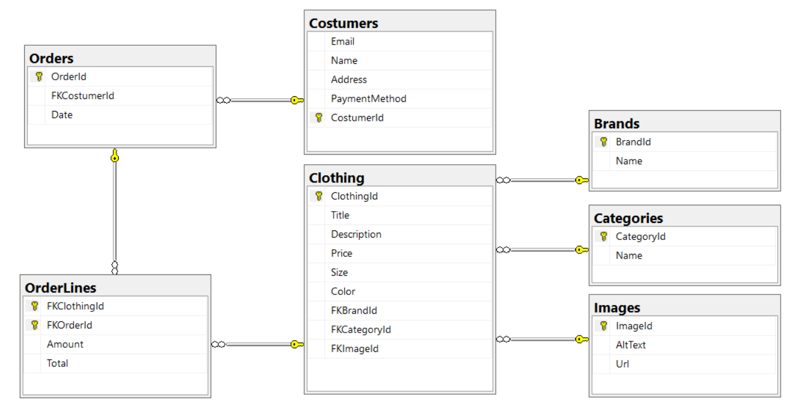
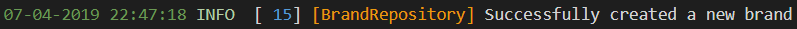

# eShop projektet

## Database-Diagram:


### Kort vejledning:
#### DataLayer:
Her ligger alle mine SQL kald til Serveren i de forskellige Repository's

NB: IdentityContext ligger dog i Web appen
#### ServiceLayer:
Her ligger alle mine DTO klasser samt mine Services

Jeg bruger AutoMapper til at mappe de forskellige DTO klasser til mine DataLayer klasser
#### Web:
Her ligger alle mine cshtml filer samt deres cshtml.cs

#### Hvordan fungere koden?
Koden fungere sådan at der fra Web fx kan komme en:

Det der så sker er at Interfacet finder ud af at den skal hen til ClothingService (Konfigureret i Startup.cs)

Den kommer så over i mit service lag som så sender den videre til ClothingRepository i mit DataLayer.

Først helt nede i DataLayer bliver SQL koden kørt og resultatet af SQL koden (Typisk Int eller <T> typen) bliver så sendt op til Service > Web

### Logging:
Jeg bruger Log4Net til at logge mine SQL kald og beskeder fra DataLayer.

For eksempel:
```C#
public class BrandRepository : LogRepository, IBrandRepository
{
    private readonly ShopContext _dbContext;
    public BrandRepository(ShopContext dbContext)
    {
        _dbContext = dbContext;
    }

    public async Task<bool> Create(Brand brand)
    {
        try
        {
            _dbContext.Brands.Add(brand);
            await _dbContext.SaveChangesAsync();
            LogInformation("Successfully created a new brand");
            return true;
        }
        catch (Exception e)
        {
            LogError("Failed to create a new brand", e);
            return false;
        }
    }
}
```
LogInformation kommer herfra:

```C#
public abstract class LogRepository
{
    private static readonly log4net.ILog Log = log4net.LogManager.GetLogger(System.Reflection.MethodBase.GetCurrentMethod().DeclaringType);

    private readonly string LogPrefix;

    public LogRepository()
    {
        LogPrefix = $"[{this.GetType().UnderlyingSystemType.Name}] ";
    }

    protected void LogInformation(string message)
    {
        Log.Info(LogPrefix + message);
    }
}
```

Output:


## Funktionelle krav til applikationen

#### NB: Det er ikke sikkert denne her er 100% Up to date! - Opdatere løbende


### Krav til forsiden [7/7] 


- [x] Forsiden viser et antal produkter med et billede af hver, prisen, navn og en knap til at lægge varen i kurven

- [x] Der benyttes Paging således at forsiden kun viser et bestemt antal produkter ad gangen. Man kan se at der evt. er flere produkter

- [x] Der er mulighed for at søge på "Brand" og på "Type" eller lignende

- [x] Der er også fritekst-søgning

- [x] Der er mulighed for stigende og faldende sortering
- [x] Der vises et ikon med en varekurv og et antal varer i kurven. Klikkes på ikonet, vises varekurven
- [x] Lægges en vare i kurven, vises den opdaterede varekurv

### Krav til varekurven [5/5]

- [x] Varekurven viser en opdateret liste af valgte produkter, med billede, navn, styk-pris, antal (skal kunne ændres) samt linjepriseen.
- [x] Der skal være en Update knap, som opdaterer priserne hvis man ændrer antallet.
- [x] Det skal være muligt at fjerne et produkt fra varekurven, hvis man fortryder valget
- [x] Der skal være en Checkout knap, som fører til Checkout-siden
- [x] Der skal være en knap, der giver mulighed for at fortsætte med at handle, inden man går til checkout

### Krav til checkout [2/2]

- [x] Brugeren skal afgive oplysninger om email, navn, adresse, valg af betalingsmiddel og forsendelse
- [x] Når brugeren trykke på Køb knappen, skal der udsendes en mail som bekræftelse af købet

## Optionelle krav til applikationen [5/6]
- [x] Forsiden viser "featured" produkter
- [x] Når musen passerer henover et billede af et produkt, fremhæves billedet (evt. med en skygge eller ramme)
- [x] Mulighed for at logge ind, f.eks. når man går til Checkout. 
- [x] Hvis brugeren er logget ind, slipper brugeren for at registrere sig igen
- [ ] Når brugeren er logget ind, vises produkter som anses for at være interessante for netop denne kunde, baseret på en profil
- [x] En Admin side, der giver en administrator en liste over alle produkter og mulighed for at redigere produkterne.


## Andre krav til design og implementation [3/3]

- [x] Designet laves således at det opfylder best practice indenfor databasedesign
- [x] Der benyttes Entity Framework Core
- [x] Der foretages en funktionstest, der viser at de funktionelle krav er opfyldt

## Krav der vedrører Web App og WebAPI [18/18]
- [x] Der benyttes Tag Helpers alle steder, hvor det er relevant
- [x] Layout-filen er stylet og tilpasset med passende navigation, top og footer.
- [x] Der benyttes et eller flere Partial Views
- [x] Der benyttes View Component
- [x] En eller flere Select controller benyttes og er "befolket" på en god måde.
- [x] Der er taget skridt til at undgå "over posting" ved at benytte ViewModel klasser hvor det er relevant
- [x] Der indgår funktionaliteter som Filtering, Ordering og Paging 
- [x] Alle brugerinput er valideret med passende fejlmeddelelser
- [x] Et eller flere eksempler på Custom Handler Methods
- [x] Overholdelse af POST-REDIRECT-GET design pattern 
- [x] Routing er tilpasset med constraints, hvor det er relevant
- [x] Anvendt forskellige former for State Management, f.eks. Cookies, TempData, Session Variable og Caching
- [x] Anvendelse af Identity til brugeroprettelse og authentication.
- [x] Applikationen er klargjort til deployment (Minifying and Bundling, Environment osv.)
- [x] Applikationen er deployet on-premise
- [x] Der er lavet et WebAPI med passende URL's til at tilgå ressourcerne
- [x] Der er taget hensyn til at de hentede objekter fra WebAPI'et skal kunne benyttes af JavaScript kode
- [x] Swagger en konfigureret og anvendt


## Optionelle krav der vedrører Web App og WebAPI [5/5]
- [x] Opret en custom Tag Helper og benyt den i et View
- [x] Alle metodekald til ServiceLayer er asynkrone 
- [x] Brug Bootstrap 4 til at fremhæve kontroller med fejl
- [x] En udbygget brug af Identity, som f.eks. mulighed for at nulstille password, email bekræftelse og roller.
- [x] Der er indbygget Logging af alle transaktioner samt fejl.


## Total: [45/46]


